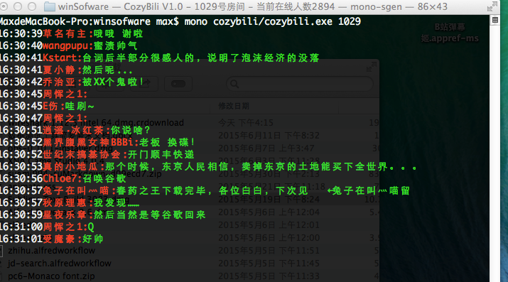

# CozyBili  [](https://ci.appveyor.com/project/MaxTan/cozybili)

这是一个获取B站生放送直播弹幕的工具：

使用方法：

```shell
打开控制台运行程序
> CozyBili.exe 房间号
```




----------

 **关于Cozy**

 - [Github](https://github.com/zpublic/cozy)
 - [Coding](https://coding.net/u/zapline/p/cozy/git)


